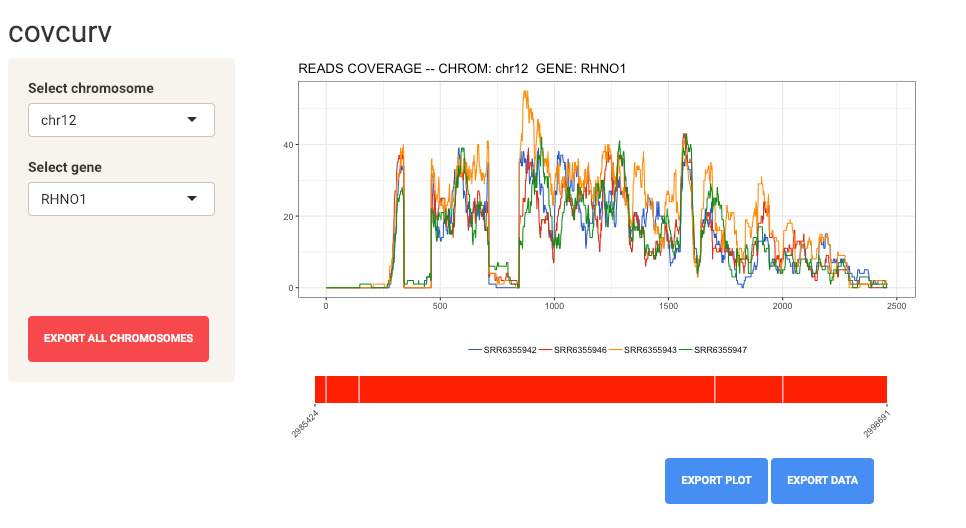
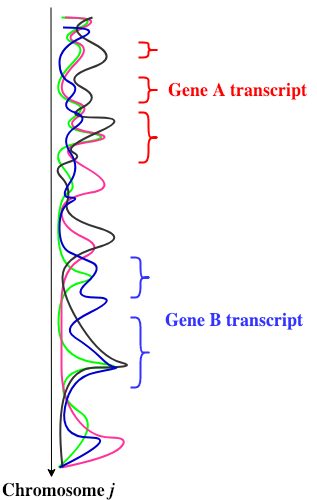
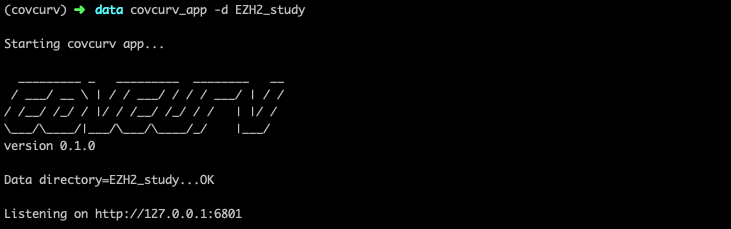

=================================================================
covcurv: per-gene coverage array pipeline and viz tool
=================================================================

While there already exist many useful tools for computing genome-wide reads coverage from individual next-generation sequencing experiments,
`covcurv` is the first **per-gene**, **multi-sample** reads coverage parsing and visualization tool. `covcurv` is a command line interface (CLI) tool
and web application. It takes aligned read (.bam) files, along with a gene annotation (.gtf) file, and gives you per-gene reads coverage arrays and visualization capabilities in your web browser.
At its core though, covcurv is just a Python package.

In addition to being able to export individual gene coverage arrays and plots, as an added bonus ``covcurv`` will also dump read counts as well!

+++++++++++++++++++
Why covcurv?
+++++++++++++++++++

There was no easy way to access gene transcript coverage data, let alone from multiple sequencing experiments simultaneously. For example, the `genomecov` function (as part of the `bedtools suite <https://bedtools.readthedocs.io/en/latest/content/tools/genomecov.html>`_) will
report coverage for all genome positions in convenient bedgraph format, but it cannot process multiple .bam files at once. Its counting logic for paired reads is undesirable:
genomecov either double counts paired read overlap regions (using `-split`), or it considers all positions between two paired reads, even when there's a gap between them (with `-pc`). Further,
there is no option to break up coverage into the coding regions that comprise a gene.
`htseq-count`'s accounting principles are more preferable, but it still does not provide coverage for multiple samples at once, and it only counts reads per feature, not per base position.

If you want gene transcript coverage based on desirable CIGAR string-based read accounting logic along with an easy way to view and export this coverage data, `covcurv` is for you.

+++++++++++++++++++
How does it work?
+++++++++++++++++++

1. **Parse .gtf file** into (gene, exon)-tuple metadata.
    - Exons at the intersection of more than a single gene are removed.
    - Coverage arrays are a concatenation of a gene's exons.

2. **Aligned reads files** are loaded (optionally in parallel, over chromosomes) and transformed into chromosome-wide coverage arrays.
    - Coverage is computed according to CIGAR score. Only "M" (match) segments contribute to coverage.
    - Paired read overlap only counts for "+1" coverage (it is not double counted).

3. **Chromosome-wide coverage arrays are diced into gene arrays** in a memory efficient manner.

+++++++++++++++++++
Getting started
+++++++++++++++++++

``covcurv`` requires aligned reads (.bam) files. Those files must be sorted in genome order with the ``samtools index`` function. If you haven't created them, required
bam index (.bai) files will also be created for you if you have ``samtools`` in your ``$PATH``. Otherwise, you will need to supply bam index files. Finally, you'll need
a genome annotation (.gtf) file. ``covcurv`` works with paired and single reads.

1. **Sort and index your alignments** with ``samtools``

.. code-block:: bash

    # sort and index alignment files in data directory
    for FILE in ezh2_data/*.bam
    do
        samtools sort $FILE -o ${FILE/.bam/}'_sorted.bam'
        samtools index ${FILE/.bam/}'_sorted.bam' ${FILE/.bam/.bai}
    done

2. **Run the ``covcurv`` pipeline**. Use ``-p`` to run with the pipeline in parallel with hyperthreading.

.. code-block:: bash

    # run pipeline on all alignments in ezh2_data directory
    covcurv --bam-dir ezh2_data \
     -o output_dir/covcurv_ezh2 \
     -g ezh2_data/genes.gtf \
     -p 4

Coverage data and

3. **Start the web app visualization tool with the ``covcurv_app`` command**. Just point ``covcurv_app`` to a ``covcurv`` output directory using the ``-d`` flag (for "data directory") and navigate to the web app's URL in your browser.
Note: ``covcurv_app`` will only work if Python3 is is the default Python in your ``$PATH``. Otherwise, pass it the path to a Python3 binary with the ``--python`` flag.

.. code-block:: bash

    covcurv_app -d output_dir/covcurv_ezh2

** ``covcurv`` arguments ** (run ``covcurv --help`` for man page)

+----------------------------------+------------------------------------------+----------------------------------------------------------------------------------------------------------------------------------------------------------------------+
|              Argument            |                 Required?                | Meaning                                                                                                                                                              |
+==================================+==========================================+======================================================================================================================================================================+
|           ``--bam-files``        | Only if ``--bam-dir`` unspecified        | Set of individual .bam files                                                                                                                                         |
+----------------------------------+------------------------------------------+----------------------------------------------------------------------------------------------------------------------------------------------------------------------+
|              ``--bai-files``     | Only if ``samtools`` is not installed    | Set of individual .bai files. If specified, must be in order corresponding to `--bam-files`.                                                                         |
+----------------------------------+------------------------------------------+----------------------------------------------------------------------------------------------------------------------------------------------------------------------+
|         ``--bam-dir``            | Only if ``--bam-files`` unspecified      | Directory containing .bam and .bai files for a pipeline run. It is assumed the .bai files have the same name as the .bam files, just with a different extension.     |
+----------------------------------+------------------------------------------+----------------------------------------------------------------------------------------------------------------------------------------------------------------------+
| ``-g``, ``--genome-annotation``  | Yes                                      | .gtf file for genome.                                                                                                                                                |
+----------------------------------+------------------------------------------+----------------------------------------------------------------------------------------------------------------------------------------------------------------------+
| ``-o``, ``--output-dir``         | No                                       | Defaults to the current working directory. Use to specify location where pipeline output directory will be written.                                                  |
+----------------------------------+------------------------------------------+----------------------------------------------------------------------------------------------------------------------------------------------------------------------+
| ``-u``, ``--unique-alignments``  | No                                       | Flag, only keep uniquely mapped reads (reads with ``NH`` (number of hits) == 1)                                                                                      |
+----------------------------------+------------------------------------------+----------------------------------------------------------------------------------------------------------------------------------------------------------------------+
| ``-p``, ``--proc-per-node``      | No                                       |Integer number of processes to spawn per compute node. The more the better.                                                                                           |
+----------------------------------+------------------------------------------+----------------------------------------------------------------------------------------------------------------------------------------------------------------------+

--------------
Installation
--------------

**This package is not yet on PyPi**.

 1. Clone the covcurv repository and `cd` into it.

.. code-block:: bash

    git clone https://github.com/NUStatBioinfo/covcurv.git
    cd covcurv

2. Create a `conda <https://conda.io/docs/user-guide/tasks/manage-environments.html>`_ virtual environment and activate it:

.. code-block:: bash

    conda create -n covcurv python=3.6
    source activate covcurv

3. Run the ``install`` script

.. code-block:: bash

    ./install
